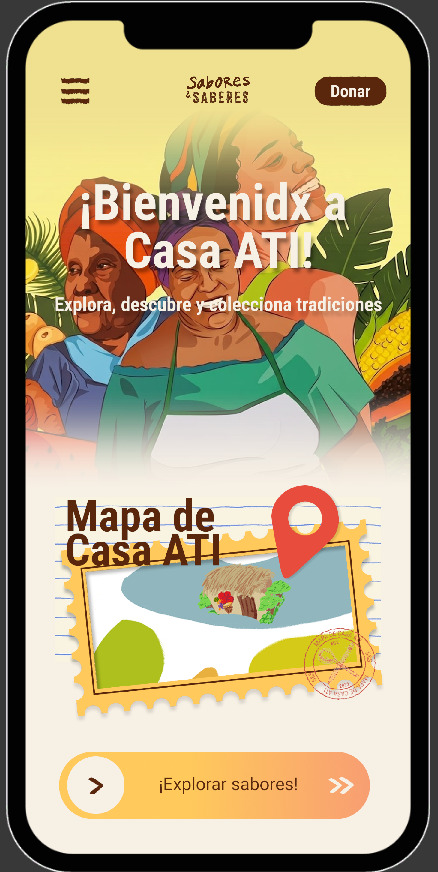
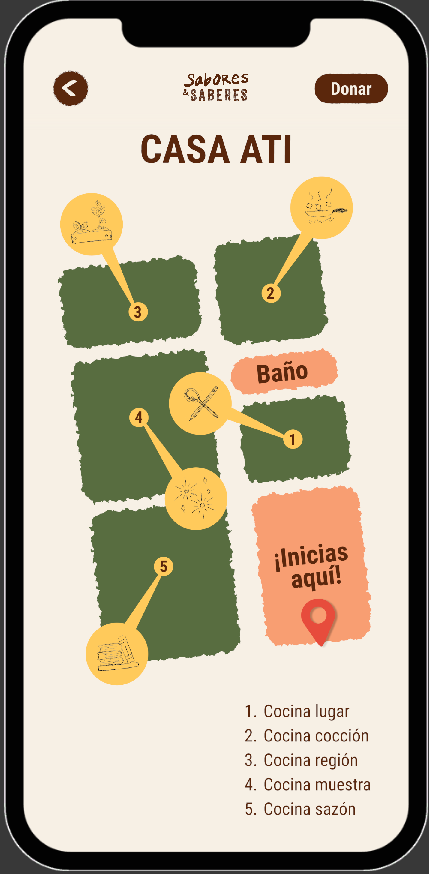
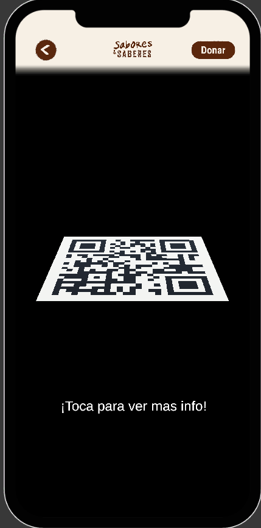
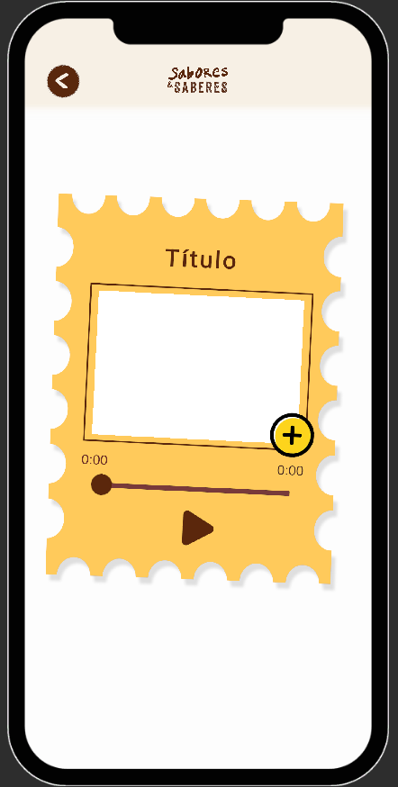

<div align="center">

# 🏛️ Casa ATI AR

### Descubre el patrimonio cultural mediante **Realidad Aumentada**

Aplicación móvil desarrollada en **Unity** que permite a los visitantes de la Casa de Cultura escanear objetos físicos para acceder a contenido cultural interactivo mediante Realidad Aumentada.


</div>

---

# 📖 Descripción

**Casa ATI AR** es una aplicación diseñada para enriquecer la experiencia de los visitantes de la Casa de Cultura mediante tecnologías de Realidad Aumentada.

Al escanear piezas u objetos físicos con la cámara del dispositivo, la aplicación identifica el elemento y despliega contenido multimedia que incluye:

- 📚 Información histórica
- 🎧 Narraciones de audio
- 🏛️ Contexto cultural
- 📱 Interacción inmersiva

---

# ✨ Características

- 📷 Reconocimiento de objetos mediante Vuforia.
- 🏛️ Información cultural contextual.
- 🔊 Reproducción de narraciones.
- 📱 Aplicación móvil intuitiva.
- 🎯 Experiencia de aprendizaje inmersiva.

---

# 🎯 Objetivos del proyecto

- Analizar el espacio museográfico.
- Integrar objetos culturales dentro de una experiencia AR.
- Desarrollar una aplicación móvil utilizando Unity y Vuforia.
- Evaluar la interacción del usuario durante el recorrido.

---

# 🛠️ Tecnologías

| Tecnología | Uso |
|------------|-----|
| Unity | Motor gráfico |
| C# | Desarrollo |
| Vuforia SDK | Reconocimiento AR |
| Android | Plataforma móvil |

---

# 📱 Funcionamiento

1. El usuario abre la aplicación.
2. Selecciona el modo de escaneo.
3. Apunta la cámara hacia un objeto.
4. La aplicación identifica el objeto.
5. Se muestra información cultural.
6. Se reproduce una narración en audio.

---

# 📸 Capturas

> Próximamente se añadirán las pantallas del proyecto.

| Inicio | Mapa |
|--------|------|
|  |  |

| Escáner | Información |
|---------|-------------|
|  |  |

---

# 🚀 Instalación

```bash
git clone https://github.com/usuario/casa-ati-ar

Abrir el proyecto con Unity.

Configurar Vuforia.

Compilar para Android.

Instalar apk en celular android e instalar.
```

---

# 📂 Estructura

```
Assets/
│
├── Scenes/
├── Scripts/
├── Prefabs/
├── Materials/
├── Audio/
├── Images/
└── Vuforia/
```

---

# 🌟 Beneficios

- Mayor interacción con el patrimonio.
- Aprendizaje inmersivo.
- Difusión del patrimonio cultural.
- Experiencia tecnológica para visitantes.

---

Universidad Simón Bolivar
